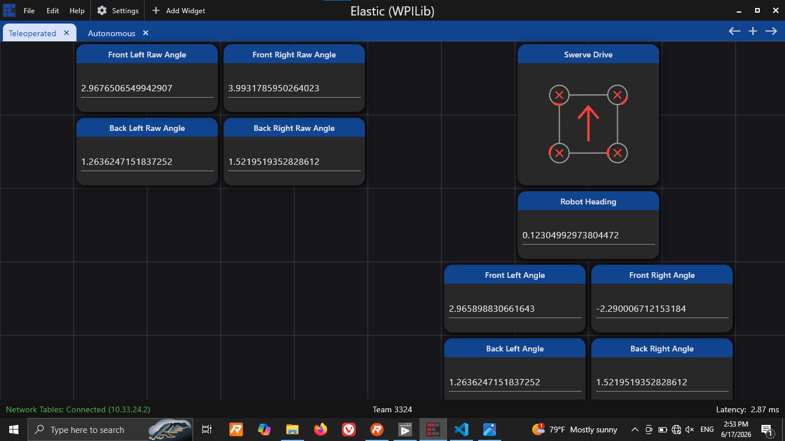

## Possible Drivetrain Fixes
- [x] If possible, zero the absolute analog encoders using Rev Hardware Client and a module alignment tool*
- [ ] If you can not zero the encoders using an alignment tool, then use Rev Hardware Client to find what value the encoders read for any given position. They should be zeroed at some multiple of 45 degrees. You can also do from within Elastic by adding widgets for `[Front/Back] [Left/Right] Raw Angle` (the `SmartDashboard` calls are in the `periodic` method of `Drivetrain.java`).
- [ ] Use the `Field` widget in Elastic to see where the robot thinks it should be (with `isFieldRelative = true`). If possible, start the physical robot from that same position and see where the paths deviate.
- [ ] **Check encoder offsets (I'm not sure how the ones in `Constants.java` were found)**\***
- [x] Check if turning off `isFieldRelative` changes how well the robot controls. Do this by changing the last argument in of `drivetrain.drive()` in `RobotContainer()` from `true` to `false`.**

## Other
- [ ] Change all instances of `spark.set()` to `spark.setVoltage()` since `setVoltage()` has voltage compensation.
- [ ] Use absolute encoder value directly instead of syncing with relative encoder in `Module.java`.

## Notes

- The absolute analog encoders (based on what I found) should have outputs in the range [0.0, 1.0].
- Use `Constants.java` to find what the CAN IDs are for the turning motor controllers
- Make sure that in Rev Hardware Client, in the absolute encoder tab, you have analog encoder selected. I don't have access to the UI right now, so I can't give exact instructions for how to change that.
- I'm 98% sure the encoders on the swerve modules are [Thrifty Absolute Magnetic Encoders](https://www.thethriftybot.com/products/thrifty-absolute-magnetic-encoder), but make sure to check that.

> If in doubt, Google it. And don't call me while I'm off the clock. You know who you are. - The Big M

## June 17th Debugging Notes

- I couldn't figure out a way to zero the encoders using Rev Hardware Client. The zero position is probably set in factory. This means the offsets have to be set in software.
- I forgot to actually disable field relative driving while testing, but since the robot wasn't rotating about the z-axis, the results should be the same regardless.
- I am 90% sure this is where the issue lies. I tried to manually set the wheels to the forward position (which should have an angle of 0 radians). I used the raw angle reading for each encoder in that position and set the offsets to those values, thereby making all of them point forward when zeroed. I did have to flip them by either adding or subtracting half a rotation (pi radians) so they would drive in the right direction, but the angles appeared to be correct. However, when I turned the robot off and on again, the angles were back to being wrong. The analog encoders are supposed to be absolue encoders, so I'm not exactly sure how that happened. 
- I couldn't see the front left or front right turning SPARK MAXes on the CAN network when using Rev Hardware Client. However, I didn't get any error messages about missing SPARK MAXes, and the turning functionality for those modules was perfectly responsive, so IDK. 
- For the back right wheel, some of the bolts which hold the tread in place were loose. This didn't affect anything since I wasn't actually moving the robot around, but it is something which needs to be fixed.
- I added some utilities for debugging. The most notable one is that the D-pad can be used to make the robot try to drive in that direction at 20% max speed.

### To-Do

Given that the issue is most likely that the encoder offsets are wrong, there are two things that need to be tested.

- [ ] Verify that the encoders keep the same value between power cycles.
- [ ] Find a consistent method for aligning the modules. Set the offsets in `Constants.java` by making note of the raw encoder values
    - This could be achieved using something like the module calibration tool which is availalbe for the MAXSwerve modules, but I don't know if something similar is available for MK4i modules.
    - Note that the calulation for the adjusted encoder value is `rawAngleRad - offsetRad`.

These can be checked using Elastic. I found success using the setup shown below:

> Closing remark: I hate this stupid chud drivetrain. - The Big M
